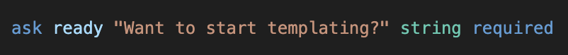

<div align="center">
  
  <br>
  <h1>spudlang VSCode</h1>
</div>

Syntax highlighting for **spudlang**, the domain-specific language used by [spudplate](https://github.com/spuddydev/spudplate), a template scaffolding system that compiles `.spud` files into standalone binaries.

## Features

- Keyword highlighting (`ask`, `let`, `mkdir`, `file`, `copy`, `include`, `run`, `repeat`, `when`, etc.)
- Clause keywords (`from`, `into`, `in`, `as`, `content`, `mode`, `verbatim`, `append`, `default`, `options`)
- Type annotations (`string`, `int`, `bool`)
- String literals with `{interpolation}` support
- `# comments`
- Logical/comparison operators (`and`, `or`, `not`, `==`, `!=`, etc.)
- Arithmetic operators (`+`, `-`, `*`, `/`)
- Built-in functions (`lower`, `upper`, `trim`, `replace`)
- Line continuation (`\` at end of line)
- Code folding for `repeat`...`end` blocks
- Auto-indent support

## File Extensions

`.spud`, `.spudplate`

## Installation

1. Copy or symlink this folder into your VS Code extensions directory:

   ```bash
   ln -s /path/to/spudlang-vscode ~/.vscode/extensions/spudlang-vscode
   ```

2. Reload VS Code (`Cmd+Shift+P` → "Developer: Reload Window")

3. Open any `.spud` or `.spudplate` file - highlighting should activate automatically.

## Syntax Reference

See the full [spudlang syntax reference](https://github.com/spuddydev/spudplate/blob/main/docs/syntax.md) in the main spudplate repo.

## Customising

To add new keywords or built-in functions, edit `syntaxes/spudplate.tmLanguage.json`.
The grammar uses standard TextMate scopes, so any VS Code colour theme will work.
